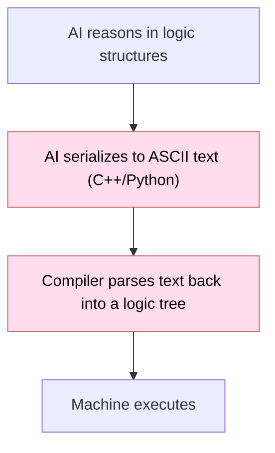
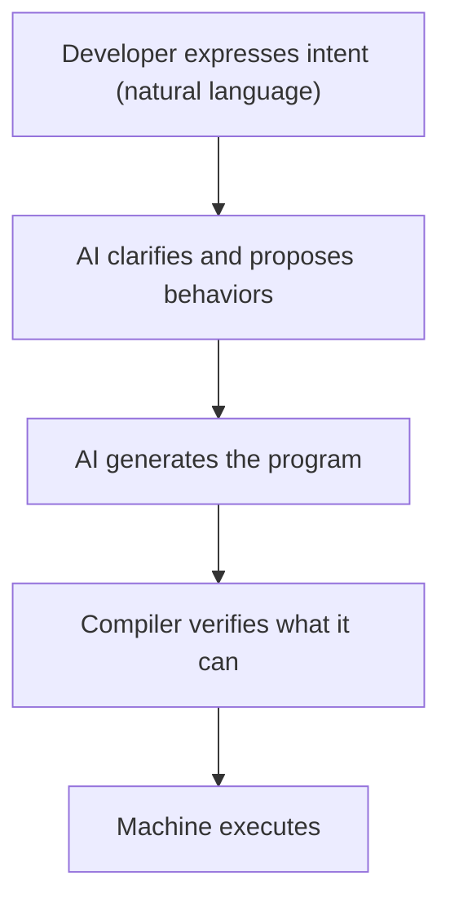
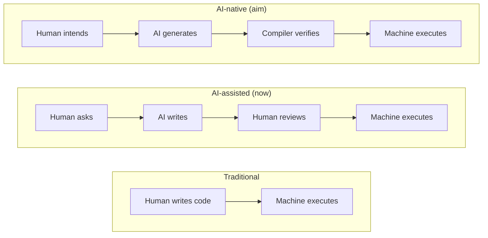
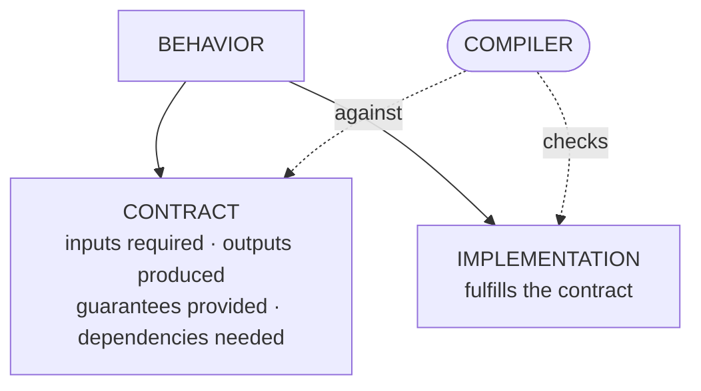
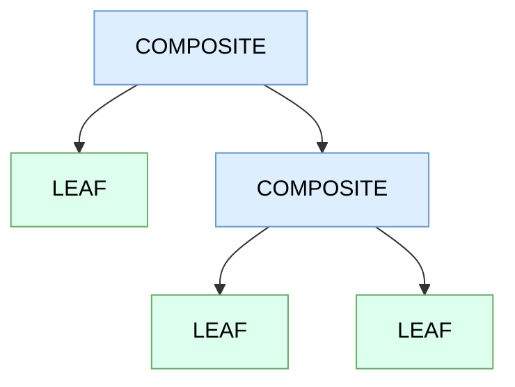

# Sigil

**An experimental, AI-native programming language — designed to be written by AI, compiled to native code through Rust and LLVM.**


> Sigil is an open exploration of one question — *should AI have a language of its own?* — taken far enough to actually test it: a working Rust + LLVM compiler, a behavior-graph model the compiler checks as a graph, a standard library, and every bundled example building and running. It's a V1 — register-level, validated on Windows, Linux, and macOS, with some of the original goals still partly enforced; [`docs/STATUS.md`](docs/STATUS.md) is the per-feature account of what's real. ["Does the idea actually help?"](#does-the-idea-actually-help) reports what testing it found — an AI learned the language cold from the spec and wrote it **correctly** (12/12 byte-exact in the re-run), at **several times the token cost** of Python: encouraging on learnability, and the cost is the open problem the next iteration targets.

---

## The problem

Current programming languages are designed for **human cognitive limits**:

- Variable names exist so humans remember what things are.
- Syntax sugar and formatting organize code for human eyes.
- High-level abstractions hide complexity humans can't otherwise track.

AI has none of these limits — large context, perfect recall within it, no fatigue. Yet AI writes Python and C++, languages shaped around constraints that don't apply to it. And compute is burned translating between formats even when no human reads the result:


*(the pink steps are the overhead — text written only to be parsed straight back)*

That round-trip — text the AI writes only to have a compiler parse it back into the structure the AI was already reasoning about — is a kind of **translation tax**, paid even when no human is in the loop. It's worth being upfront that this is a *motivating intuition, not a measured cost*: when it was actually tested ([below](#does-the-idea-actually-help)), the tax ran the other way — Sigil's own text cost several times **more** tokens than the languages the model already knew. The intuition is what started the project; the result is what the project found.

So the question Sigil starts from: **if AI is the one writing the code, should it have a language of its own — designed around how it works, instead of around how we do?**

## The aspiration

The end-state Sigil reaches toward is one where AI is the intermediary between human intent and machine execution:



In that picture the developer's interface is conversation, the language is something AI generates and machines verify, and a human reads it only if they choose to. **This is the north star, not a description of what's built** — there is no natural-language-to-program pipeline in this repo. What *is* built is the layer underneath it: the language and the compiler.

### Why safety matters more, not less, when AI writes the code

If AI writes the code, does language-level safety still matter? More than ever. AI generates statistically plausible but sometimes wrong code, and at machine speed mistakes multiply faster than humans can review them. A strict, checkable language turns the compiler into a quality gate: AI proposes, the compiler rejects what it can prove is unsound before it ever runs. The stricter the language, the more the machine — not a human reviewer — catches first.



---

## Behaviors and contracts

The unit of every Sigil program is a **behavior** — a *contract* paired with an *implementation* the compiler checks against it.



Traditional development keeps specification, code, and tests as three artifacts that drift apart over time; bugs hide in the gaps between them. A behavior is meant to collapse those into one: the contract *is* the specification, the implementation *is* the code, and the compiler checking the match stands in for some of the tests.

**Leaf** behaviors do the actual work, built from the language's primitive operations. **Composite** behaviors add no new computation — they are pure wiring of other behaviors. Put together, a whole program is a graph: leaves at the bottom computing, composites above connecting them.



### A complete program

The smallest real example — print `Hello, World!`. An entry point that calls one behavior:

```
EXECUTABLE hello-world
ENTRY
  CALL direct
END_EXECUTABLE
```

and the behavior it calls — a contract (one output, one dependency, one guarantee) paired with a composition that fulfills it:

```
BEHAVIOR direct
CONTRACT
  OUTPUT status int 8
  REQUIRES println@a273ebb3       # stdlib behavior, pinned by its contract hash
  GUARANTEES writes_output
HASH f9de110d
COMPOSITION
  msg = "Hello, World!"
  CALL println msg
  SET status 0
END
```

That compiles to a native `.exe` and prints `Hello, World!`. It lives in [`examples/hello-world/`](examples/hello-world/); seven more — file I/O, a key-value store, an HTTP server, and four concurrency demos — are in [`examples/`](examples/).

### The ideas underneath

- **The contract comes first.** Rather than "here is a function, and here is a contract describing it," the contract *is* the behavior and the implementation merely fulfills it. Incompleteness then becomes *structural*: a behavior with an input that has no source isn't missing documentation — it's an incomplete structure.
- **Gaps are questions.** An input without a source, an output nothing consumes — each structural gap is a precise question that must be answered to finish the program, rather than a bug hiding for later.
- **Decomposition bottoms out.** Every chain of composition eventually reaches primitives — atomic operations that can't be decomposed further. Because the floor is fixed, decomposition terminates.
- **Structure vs. meaning.** This kind of checking can guarantee *structural* completeness — outputs consumed, inputs sourced, paths handled. Whether a behavior does what was *intended* stays a human responsibility.

None of these mechanisms is new on its own: design-by-contract goes back to Eiffel (1986), declaring and checking effects echoes Java's checked exceptions, and modelling a program as a typed dataflow graph is what compilers already do internally. What's being tried here is the combination, aimed at machines writing the code. The full reasoning — why an AI author changes the abstraction question, why programs are graphs, and what structural completeness does and doesn't guarantee — is in **[Designed for the AI Author](docs/DESIGN-MODEL.md)**.

---

## Designed around AI's constraints

The design choices follow from what an AI actually struggles with.

**Limited context.** An AI can't hold a whole codebase in memory. So the intent is for it to navigate by *contracts*, not implementations — a contract is small and self-contained:

```
CONTRACT
  INPUT  request  bytes 8192
  OUTPUT response bytes 4096
  REQUIRES parse@a3f8c2 format@d4e5f6
  GUARANTEES writes_output
```

For composition — wiring behaviors together — the contract is all you need; implementations only come into context when writing a new leaf.

**No memory between sessions.** An AI can't remember what it built yesterday. Each dependency is pinned by a hash of the callee's contract — `REQUIRES parse-http@a3f8c2` — so the hash *is* the memory: read the contract, see the hash, know the exact interface; if the dependency changed, the hash changed and the compiler catches the mismatch.

**Libraries preserve context.** Every library behavior is a question already answered. Without one, an AI spends context re-deriving "how do I read a file?"; with one it just `CALL`s it. Richer libraries mean less context spent on solved problems.

---

## Design decisions

### Topology, not syntax

AI cares less about "language" than about **topology** — what connects to what. A Sigil program *is* a graph, and not by analogy: a behavior is a node (identified by its content-addressed contract hash), its contract's inputs and outputs are typed ports, and its `REQUIRES@hash` dependencies and composition wiring are the edges. The compiler builds this behavior graph and checks it *as a graph* — transitive purity, circular dependencies, dependency-hash pins, and output consumption all run over it (`compiler/src/graph/`). Leaves drop one level lower, to the SSA-style primitive graph (load/store/add/branch) that LLVM also uses internally.

The line-based `.beh` format is a **serialization** of that graph — each line a node, its references the edges — tuned for sequential token generation. It is a *view* of the graph, not a separate text language the graph has to be recovered from: the same content-addressed graph is what the compiler builds and verifies. Having the model construct the graph through direct validated steps instead of emitting this serialization is a future *authoring* ergonomic — today's models emit tokens — not a missing foundation.

### Other choices, briefly

- **Level 3, not 4 or 5.** Sigil sits at the intermediate-representation level — strict types, explicit memory, no sugar, what a compiler uses internally after parsing — not application convenience (Python) or assembly's architecture-specific verbosity. (The full abstraction ladder is in [The Sigil Experiment](docs/THE-SIGIL-EXPERIMENT.md).)
- **Behaviors, not functions.** Define once, reference anywhere, and let the compiler decide inline-or-call. Leaves hold primitives; composites hold only wiring.
- **Global memory.** One address space (what machines actually have); the compiler proves each access safe rather than the language preventing it. Per-node state (safe but copy-heavy) and explicit regions (hybrid complexity) were considered and rejected.
- **Also rejected:** visual programming (node graphs are for human eyes), an orchestration layer (Sigil is the execution substrate, not a layer above agents like LangGraph), and interpretation (it compiles to native code via LLVM).

---

## What works, and what doesn't

The compiler is real, and the checking is thorough at two levels: *per-behavior* (inside a behavior) and *whole-graph* (the wiring *between* behaviors). What remains unbuilt isn't the checking but the denser V2 surface syntax and compiler-inferred parallelism — the concurrency runtime itself works.

**Works today**
- A Rust + LLVM 18 compiler that produces native executables for the host (x86-64 and arm64); all bundled examples build and run on Windows, Linux, and macOS (CI-verified).
- The 43 primitive operations, handle-based memory (opaque handles, single ownership), and contract hashing.
- Per-behavior checks (CFG-aware, across all execution paths): type/size matching; static bounds checking; use-after-free, double-free, uninitialized-read, and memory-leak detection; ownership (you can't free a borrowed input or a handle a live `SPAWN` is using); atomic access to `SHARED` memory; and "every output is written on every path." All with unit tests.
- Cross-behavior (whole-graph) **dependency** checks: **transitive purity** (a `pure` behavior can't depend, even transitively, on a non-pure one), **circular-dependency** rejection, and **dependency hash pins** (a `REQUIRES name@hash` whose pin no longer matches the dependency's current contract is a compile error — including for linked stdlib deps) — wired into the compile pipeline, with tests.
- Cross-behavior (whole-graph) **port completeness**: in a composition every output a `CALL` produces must be *consumed* (routed onward, used as a `BRANCH` condition, or written to an `OUTPUT`) or explicitly `DISCARD`ed — an unconsumed output is a compile error (`E0511`); inputs are checked via `CALL` argument count/type checking (full port-level input-sourcing over a wired graph is implemented but unwired on V1 — the V2 graph piece). All bundled examples comply.
- Concurrency: `SPAWN` / `WAIT` / `CHANNEL` lower to a green-thread runtime on real OS threads with bounded channels — the `spawn-test`, `parallel-test`, `channel-test`, and `producer-consumer` examples build and run — and the compile-time concurrency-safety checks (atomic-on-`SHARED`, free-while-borrowed) are enforced.

**Not yet**
- A denser **V2 surface syntax** — expressions and ordinary control flow in place of raw load/store/branch — is not built. This is the token-cost lever the experiment points at; everything today is written at the register level.
- The compiler doesn't auto-parallelize independent calls (they run sequentially), and `WAIT` result-passing is simplified; no performance benchmarks.

The short version: per-behavior checking is real and fairly thorough, and the cross-behavior checks — dependency (transitive purity, no cycles) *and* port completeness (outputs consumed, inputs sourced) — are enforced. What remains is the denser V2 syntax and auto-parallelization. Per-feature detail in [`docs/STATUS.md`](docs/STATUS.md).

---

## The compiler

The Sigil compiler (Rust + LLVM) checks AI-generated behaviors and lowers them to native code.

**Type system** — four interpretations (`int`, `float`, `bytes`, and `string` — the last self-describing and length-prefixed), explicit sizes (1/2/4/8 bytes) where they apply, interpretation matching enforced, no implicit conversions.

**Memory safety** — handles instead of raw pointers (opaque, non-forgeable), single ownership per handle, scoped allocation, bounds checked against allocation size. These are *static* (compile-time) checks of the memory discipline; `ALLOC` allocates on the heap via a per-behavior scope allocator, `FREE` frees, and `SCOPE`/`END_SCOPE` free at the boundary (a `SCOPE` in a loop stays bounded), with whatever is left freed at behavior return ([STATUS.md](docs/STATUS.md)).

**Guarantee checking** — the three guarantees a behavior can *declare* in its `GUARANTEES` line, verified at compile time:

| Guarantee | Meaning | Status |
|-----------|---------|--------|
| `writes_output` | all outputs written on all paths | enforced |
| `no_alloc` | no escaping allocation (a scoped `ALLOC` is fine) | enforced |
| `pure` | no state access / side effects | enforced (structural), incl. transitively across calls (residual gap: *undeclared* pattern-`MEMORY` use — declared `MEMORY` is caught) |

Plus one check applied to **every** behavior automatically (not a declarable keyword): **termination-as-reachability** — every block must be able to reach an exit, which rejects exit-less loops. It is a structural check, not a semantic halting proof.

**Dependency verification** — contract hashes identify behavior versions; a hash mismatch is a compile error. (The earlier `no_syscall` guarantee and a `CAPABILITIES` system were removed from the language; system access now goes through NATIVE behaviors.)

**Code generation** — LLVM backend with optimization, native executables for the host architecture (x86-64 and arm64 both validated), automatic runtime linking.

## The runtime

A small C runtime provides the system-access behaviors (file, console, networking) the standard library wraps, plus a working concurrency runtime.

The model: lightweight tasks on a fixed worker pool (N workers for N cores), and bounded multi-producer/multi-consumer channels with blocking send/receive — exposed through `SPAWN`, `WAIT`, `WAIT_ALL`, `WAIT_ANY`, `CHANNEL`, `CHANNEL_SEND`, `CHANNEL_RECEIVE`, `CHANNEL_CLOSE`. The compiler lowers these to runtime calls that run on real OS threads, and the `spawn-test`, `parallel-test`, `channel-test`, and `producer-consumer` examples build and run.

> The compile-time concurrency-safety checks **are** enforced — non-atomic access to a `SHARED` handle and freeing a handle a live `SPAWN` still borrows are both compile errors (with tests). What's *not* done: the compiler does not auto-parallelize independent calls (they run sequentially), `WAIT` result-passing is simplified; there are no performance benchmarks. See [`docs/STATUS.md`](docs/STATUS.md).

---

## The 43 primitives

Everything that does real work bottoms out in 43 primitive operations — the language's fixed low-level floor (a deliberately ISA-flavored set, chosen for directness rather than as a minimal basis):

| Category | Primitives |
|----------|------------|
| Memory | ALLOC, LOAD, STORE, FREE |
| Atomic | ATOMIC_LOAD, ATOMIC_STORE, CAS, ATOMIC_ADD, ATOMIC_SUB |
| Integer | IADD, ISUB, IMUL, IDIV, IMOD, INEG |
| Integer compare | IEQ, INE, ILT, IGT, ILE, IGE |
| Float | FADD, FSUB, FMUL, FDIV, FNEG |
| Float compare | FEQ, FNE, FLT, FGT, FLE, FGE |
| Conversion | ITOF, FTOI |
| Bitwise | AND, OR, XOR, NOT, SHL, SHR, SAR |
| Control | BRANCH, JUMP |

System interactions go through NATIVE behaviors backed by the C runtime, not raw system calls. Full grammar and semantics: the [Language Reference](docs/SIGIL-LANGUAGE-REFERENCE.md).

---

## Building and running

The instructions below are for Windows, the development platform. Linux and macOS build the same stages with system toolchains — `cargo` + system LLVM 18, `runtime/build.sh`, and the same `--lib` stdlib build — exercised end-to-end by [CI](.github/workflows/ci.yml).

### Prerequisites

- **Rust** (stable, `x86_64-pc-windows-msvc` toolchain).
- **Visual Studio Build Tools** — the MSVC C++ toolchain (`cl`, `link.exe`, the Windows SDK). The compiler discovers it automatically via `vswhere`, so any shell works.
- **LLVM 18.1.x with development libraries.** `llvm-sys`/`inkwell` link against LLVM's static libs, so the full dev package is required — **not** the plain `LLVM-*-win64.exe` runtime installer (it ships neither `llvm-config.exe` nor the static libs). Use the official `clang+llvm-18.1.x-x86_64-pc-windows-msvc.tar.xz` from the [LLVM releases](https://github.com/llvm/llvm-project/releases), extract it to e.g. `C:\LLVM`, and point the build at it:
  ```powershell
  setx LLVM_SYS_180_PREFIX "C:\LLVM"
  ```
  Also add `C:\LLVM\bin` to your `PATH` — the standard-library build invokes `llvm-ar` from it.
  That package's `llvm-config --system-libs` lists `libxml2s.lib` but doesn't ship it, so linking fails with `LNK1181`. Sigil doesn't use libxml2, so a valid empty stub satisfies the linker:
  ```powershell
  # from a VS x64 Native Tools prompt
  echo void __stub(void){} > stub.c && cl /nologo /c stub.c && lib /nologo /OUT:"C:\LLVM\lib\libxml2s.lib" stub.obj
  ```

### Build

```bash
compiler\build.bat --release     # the compiler
compiler\build.bat --test        # build + run the test suite
runtime\build.bat                # the C runtime
stdlib\build.bat                 # the standard library
```

Build the compiler, runtime, and standard library before compiling an example — the example scripts link against all three.

### Run an example

```bash
examples\hello-world\build.bat
examples\hello-world\build\hello-world.exe     # prints: Hello, World!
```

### Authoring skill for AI agents

Sigil is meant to be written by an AI agent, and the agent needs the bundled **authoring skill** to write it correctly — it carries the workflow the AI must follow: filling contract `HASH`/`REQUIRES` version pins (never hand-computing them), the leaf/composite and output-consumption rules, and discovering existing stdlib behaviors. The skill ships at [`skills/sigil-authoring/`](skills/sigil-authoring/); **add it to your AI agent so the AI uses it.**

This is per-agent setup, not per-project. For Claude Code, install it into your agent's skills directory:

```bash
mkdir -p ~/.claude/skills/sigil-authoring && cp -r skills/sigil-authoring/* ~/.claude/skills/sigil-authoring/
```

The agent then auto-invokes it whenever you write Sigil, or you can call `/sigil-authoring` directly. (Other agents/tools: install the skill per their own skill mechanism.)

---

## Does the idea actually help?

Sigil's premise is testable, so it was tested — twice. The same task (an HTTP file relay) was generated in Sigil and in languages the model already knows well, first with one model, and later more rigorously with a stronger one and three trials per condition.

One result was never in doubt, and isn't really the question. A brand-new language the model has never been trained on will cost more tokens than Python — that's a property of zero training data, not a verdict on the design — and the test confirmed it: Sigil ran several times more expensive, and a stronger model narrowed the gap on *correctness* but not on *cost*. The point of measuring was never *whether* it costs more (it does, expectedly) but *how much*, *why*, and *what that says about where to push next*.

The more interesting half is encouraging. Despite zero training data, the model learned the entire language **cold — from the grammar and the stdlib contracts alone — and wrote it correctly**: 12/12 byte-exact in the re-run, with rework falling to about two cycles. That is the learnability half of the bet holding up: a small, explicit, regular language (43 primitives, contracts that state everything, no ambiguity) turns out to be *tractable for an AI that has never seen it* — it can be picked up from the spec and used correctly, which is the harder thing and the thing that has to be true first. The token cost is the known tradeoff: partly genuine register-level verbosity, partly the simple absence of any learned compression (a trained language ships its compression in the weights and tokenizer; a new one ships none), and the experiment can't separate the two — so whether *training* on Sigil closes the gap is the obvious next measurement.

The friction moved twice as the obvious gaps were filled. The first run's biggest friction wasn't the language at all — it was a missing tool (computing contract hashes by hand); the `--hash` command was added, and a follow-up run confirmed agents stopped re-deriving the hash. With that gone, the next friction was hand-rolling low-level boilerplate the standard library didn't yet cover — building a `sockaddr`, reading a file, formatting a timestamp. So the library was built out (~92 behaviors), and a further run found agents now reach for it (`make-sockaddr`, file I/O, time) and hand-roll only what genuinely has no library equivalent (HTTP framing). What that leaves is the language's own register-level verbosity — which tooling can't touch and a denser syntax can. Each run also keeps paying its way as free QA: the latest surfaced real compiler bugs, which were fixed and the fixes confirmed by re-running the experiment on the clean compiler.

The complete study — every run, its method and conclusions, every trial, and the raw session transcripts that are the actual evidence — is under [`experiments/`](experiments/); the full narrative is [The Sigil Experiment](docs/THE-SIGIL-EXPERIMENT.md).

## Where it's headed

This is a first pass, and it points somewhere specific — each run was instrumentation, isolating what actually drives the cost and the friction so the next iteration knows where to start. Three of the directions it pointed at have since landed: a real contract-hash tool (`sigil-compiler --hash <file>`, removing the dominant hand-computation friction); checking the wiring *between* behaviors, so an incomplete graph is rejected rather than quietly built (outputs-consumed, `E0511`); and a built-out standard library (~92 behaviors, with a discoverable [catalog](docs/STDLIB-CATALOG.md)), so an agent reaches for `make-sockaddr`/file-I/O/time instead of hand-rolling them. The remaining, deeper direction is a denser surface syntax — expressions and ordinary control flow in place of raw load/store/branch — that still lowers, unambiguously, to the same checked graph, buying back tokens without giving up the safety or the from-the-spec learnability. That is the cost lever the measurements point at, and the reason to run the next iteration.

---

## Documentation

- [The Sigil Experiment](docs/THE-SIGIL-EXPERIMENT.md) — the full narrative: the question, the design, and every experiment run
- [Designed for the AI Author](docs/DESIGN-MODEL.md) — the design model: contracts, behavior graphs, completeness, and its limits
- [Implementation Status](docs/STATUS.md) — what is done, partial, or design-only
- [Language Reference](docs/SIGIL-LANGUAGE-REFERENCE.md) — grammar and semantics
- Design spec — [Primitives](docs/spec/PRIMITIVE-LAYER.md) · [Types](docs/spec/TYPE-SYSTEM.md) · [Memory](docs/spec/MEMORY-MODEL.md) · [Composition](docs/spec/COMPOSITION.md) · [Contracts](docs/spec/CONTRACT-SCHEMA.md) · [Graph format](docs/spec/GRAPH-FORMAT.md) · [Project structure](docs/spec/PROJECT-STRUCTURE.md) · [Safety](docs/spec/SAFETY-RULES.md) · [Concurrency](docs/spec/CONCURRENCY.md)
- [V2 ideas](docs/V2-ROADMAP.md) — where v1 points next, including the proposed [token-space density objective](docs/v2-density-pillar.md)
- [Experiments](experiments/) — methodology, per-run results, and raw transcripts

## License

Apache 2.0
